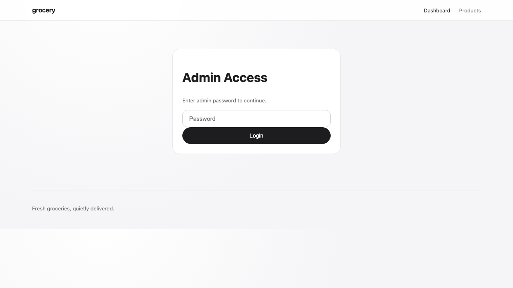

# Grocery App

Minimal Apple-inspired grocery store web app built with PHP 8.1+ and MongoDB.

## Screenshot



## Tech Stack

- PHP 8.1+
- MongoDB
- Vanilla HTML, CSS, JavaScript

## Run Locally

1. Install dependencies:

   ```bash
   composer install
   ```

2. Ensure the root `.env` file exists and contains valid values for:

   - `MONGODB_URI`
   - `MONGODB_DB`
   - `ADMIN_PASSWORD`
   - `VAPID_PUBLIC_KEY`
   - `VAPID_PRIVATE_KEY`
   - `VAPID_SUBJECT`

3. Start the development server:

   ```bash
   php -S 127.0.0.1:8080 -t public public/index.php
   ```

4. Open in browser:

   ```
   http://127.0.0.1:8080
   ```
